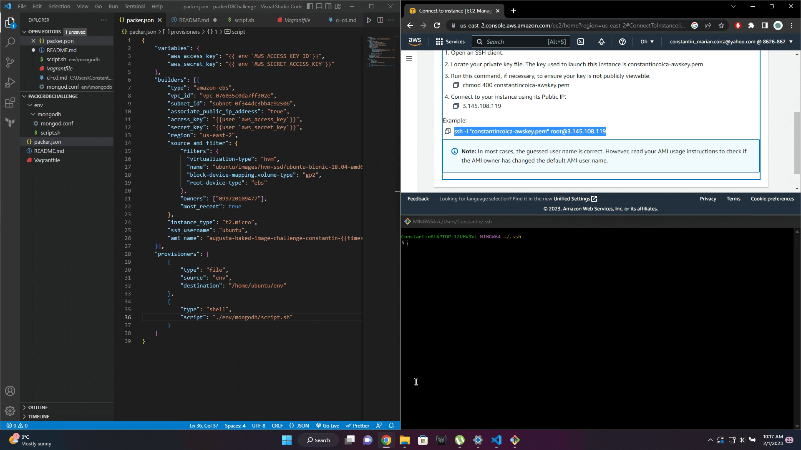

# Description

This project showcases configuring an AMI image done through Packer. This is done using a packer.json file to define the data necessary
for the AWS to create an AMI image that can be used to create an instance by defining variables, builders and the provisioners. 
When the instance will be run, a working mongodb service will be built, started and avaiable.

- Variables: the AWS keys for allowing and making the connection.
- Builders: The way the AMI will be built, which include the type, the vpc, the instance type etc.
- Provisioners: Which files will be used when the AMI and Instance will be created. The mongod.conf which will be used to add the configuration and
the script which will be ran in order to download, install and start the mongodb service.

# Demo

